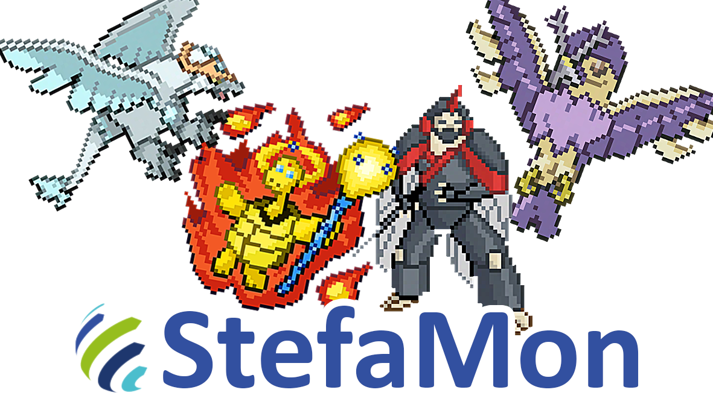

### Desafio Hackathon Stefanini

# StefaMon:
### StefaMon é um sistema de rinha de criaturas mágicas onde jogadores disputam batalhas acirradas em busca de ser o melhor treinador. Vença as batalhas e conquiste seu lugar no ranking.

# Objetivos Principais:
- ### **Consertar os diversos bugs que estão na aplicação;**


- ### **Desenvolver um sistema que obedeça as boas práticas de programação;**
    - Root da api deve ser a url ‘/api’; ex: localhost:8080/api/…
    - Os end-points devem obedecer aos verbos HTTPs corretos;
    - Princípio da responsabilidade única;


-   ### **Criar a entidade (JAVA) Jogador com os atributos:**

    -   **Nickname**:
        -   Obrigatório;
        -   Os nicknames devem ser únicos;
    -   **Senha**:
        -   Obrigatório;
        -   Deve ser criptografada;
        -   Tamanho mínimo de 4 caracteres;
        -   Tamanho máximo de 10 caracteres;
    -   **Stefamons:**
        -   Lista de StefaMons (ManyToMany);
    -   **Saldo**:
        -   Obrigatório;
        -   Campo de valor BigDecimal;
        -   Deverá ter um valor padrão (Você escolhe)


-   ### **Criar funcionalidade de cadastro de Jogador**
    -   Obedecendo os critérios da Entidade Jogador:


-   ### **Criar funcionalidade de login que valide o nickname e senha salvos no banco de dados;**
    -   Mostrar mensagem de erro (mensagem a sua escolha) caso os dados informados estejam incorretos;
    -   Somente jogadores cadastrados poderão batalhar;
    -   Apenas uma validação simples não é necessário implementar nenhum framework de autenticação;


-   ### **Criar a funcionalidade de comprar/escolher StefaMons;**
    -   O preço do StefaMon será uma média do valor dos seus atributos;
        -   Esse preço não é persistido em banco, será calculado em tempo de execução e será implementado como quiser;
    -   O jogador poderá ter no máximo 6 StefaMons e no mínimo 1 StefaMon para batalhar;
    -   Pode ser feito na hora de cadastro ou após o primeiro login;


-   ### **Criar funcionalidade de Batalha (poderá ser implementada como quiser) respeitando os seguintes critérios:**
    - **A Batalha é composta pela quantidade de StefaMons de cada Jogador**
      - Ex: Jogador1 tem 4 Stefamons X Jogador2 tem 6 StefaMons
    - **Criar o modo de batalha contra outro Jogador;**
        -   Os 2 jogadores devem estar cadastrados no sistema e com StefaMon(s) selecionado(s);
        -   Implementar uma lógica de ganho de moedas (saldo do jogador)
    - **Criar o modo de batalha contra BOT;**
        -   O bot sempre escolherá 6 StefaMons aleatórios;
        -   (Opcional) Implementar uma lógica de ganho de moedas (saldo do jogador)
    - **Apresentar o Jogador vencedor da batalha;**  
      - Não poderá haver empate, a lógica da batalha deverá indicar um vencedor;
    - **Deverá ser utilizado pelo menos 1 atributo do StefaMon além dos atributos obrigatórios;**
    
    <br/>
    
    - **Obs:** 
      - Basicamente fazer apenas a batalha. Escolher um adversario, fazer a lógica da batalha e apresentar o vencedor;
      - Desenvolver além dos objetivos principais (descritos acima) serão considerados objetivos extras (descritos abaixo) e só serão avaliados se os objetivos principais
      estiverem concluídos;
      - Ideias de tipos de batalhas: [Instruções](./Instruções.md)

---
# Objetivos Extras:
-   ### **Criar um ranking de jogadores;**
    -   Mostrar um ranking de jogadores que mais venceram batalhas;
-   ### **Apresentar um LOG do ocorrido na batalha;**
    -   Movimentos (Ataques e defesas) de cada StefaMon;
    -   Derrota de cada StefaMon;
-   ### **Funcionalidade de histórico de batalhas (histórico de partida);**
    -   Mostrar cada batalha do Jogador, vitórias e derrotas;
    -   Preferencialmente apresentando o LOG de batalha também;
-   ### **Criar um redirecionamento para uma página Not Found quando acessar uma URL que não existe no Frontend;**
-   ### **Desenvolver funcionalidades a sua escolha;**
    -   Fique a vontade de desenvolver novas funcionalidades para o desafio, lembrando que os objetivos extras 
    só serão avaliadas se os objetivos principais estiverem concluídos;
---

# Tabelas:
- ### **Jogador:**
    -   **id:** BigInt
    -   **Nickname:** Varchar
    -   **Senha:** Varchar
    -   **Saldo:** BigDecimal
  
- ### **Jogador_Stefamon**
    -   **IdJogador:** BigInt
    -   **IdStefaMon:** BigInt

## Tabelas de domínio (apenas leitura):

- ###   **StefaMon**:
    -   **Id:** (Não é um atributo de lógica)
    -   **Nome:** (Não é um atributo de lógica)
    -   **Vida:** (Atributo de lógica **Obrigatório**)
    -   **Ataque:** (Atributo de lógica **Obrigatório**)
    -   **Defesa:** (Atributo de lógica **Obrigatório**)
    -   **Inteligência:** (Atributo de lógica Opcional)
    -   **Poder:** (Atributo de lógica Opcional)
    -   **Velocidade:** (Atributo de lógica Opcional)

Jogo baseado em:
[https://www.tuxemon.org/](https://www.tuxemon.org/)

---

# Arquitetura do projeto
- [Instruções Arquiteturais](./Instruções.md)

### Pré-Requisitos *obrigatórios*:
 - Git
 - JDK 11+
 - Maven 3.8.1
 - MySql/MariaDB

### Pré-Requisitos *opcionais*:
 - Docker (Caso queira usar o mysql que tem no projeto)
 - Docker Compose (Normalmente vem com o docker)

## Rodar a aplicação em modo de desenvolvimento

## Docker
**Lembrando que esses comando são no terminal dentro da pasta _"./src/main/docker"_**
<br/><br/>
E caso queira usar o MySQL no docker:<br/>
<small>Obs: Não use o "-d" caso queira que o terminal do docker fique aberto.</small>
```
docker-compose up -d 
```
<br/>

E para parar o MySQL no docker:<br/>
<small>Obs: Não precisa caso não tenha usado o "-d"</small>
```
docker-compose down
```

## Maven
**Lembrando que precisa do MySQL já esta rodando!**<br/>

Use o seguinte comando para iniciar o servidor:<br/>
<small>Obs: Esse comando deve ser executado na _raiz_ do projeto!</small>
```shell script
./mvnw clean compile quarkus:dev
```


#### Alguns guias relacionados:
- Maven ([guia](https://maven.apache.org/what-is-maven.html))
- Hibernate ORM (Implementação do JPA) ([guia](https://docs.jboss.org/hibernate/orm/current/userguide/html_single/Hibernate_User_Guide.html))
- RESTEasy JAX-RS ([guia](https://docs.jboss.org/resteasy/docs/3.0.9.Final/userguide/html_single/index.html))
- MySQL ([guia](https://dev.mysql.com/doc/))

Opcionais:
- Docker([guia](https://docs.docker.com/))
